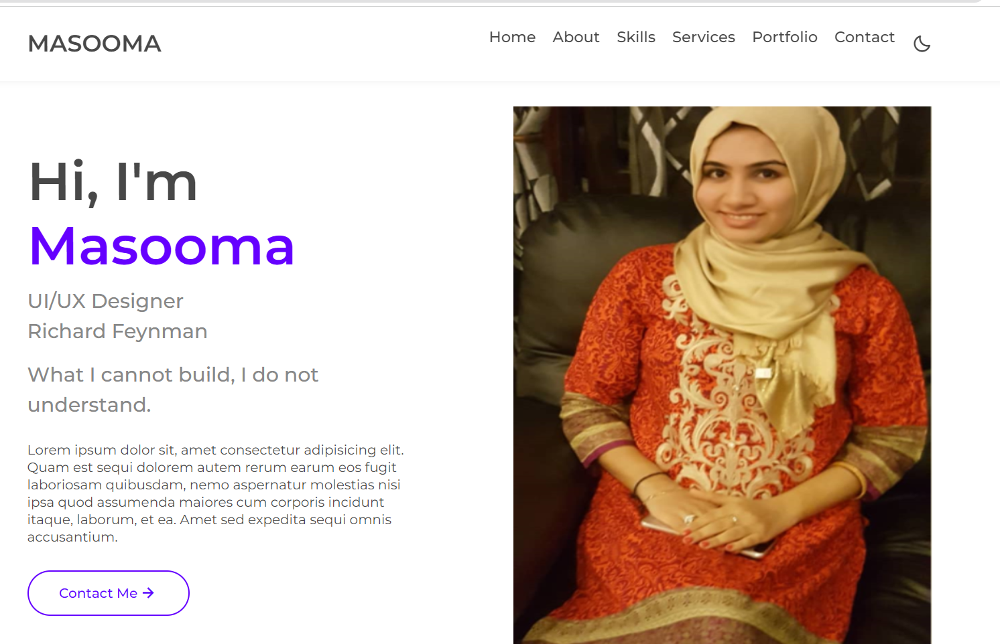

# Portfolio

#### Masooma Hasnain

I have made my profile portfolio with my details. In my website where the user can interect like and click the button. It has interactive javascript, which gives users a message while clicking. Overall it was the great project.

### Built With

- HTML
- CSS
- JavaScript
- API

### Description

My portfolio provides my information about me , it shows my picture, It has navbar, body. It shows my name, my position. It has contact me button, where people can contact me.

### Screenshot

## Getting Started

**To get a local copy up and running follow these steps:**

### Prerequisites
You need an IDE of your choice (preferably Visual Studio Code).
You will need a browser (preferably Chrome) to view the webpage.
You need to have installed npm and JSON-server on your local machine. 

### Setup
Clone the project using these links depending on your local environment:
- [https](https://github.com/masoomapunjwani/FAQ-page.git) or [ssh](git@github.com:masoomapunjwani/FAQ-page.git)

### Install
- On the root folder, locate the ``index.html`` and open with your IDE
- Run LiveServer to open the page on your default browser.

